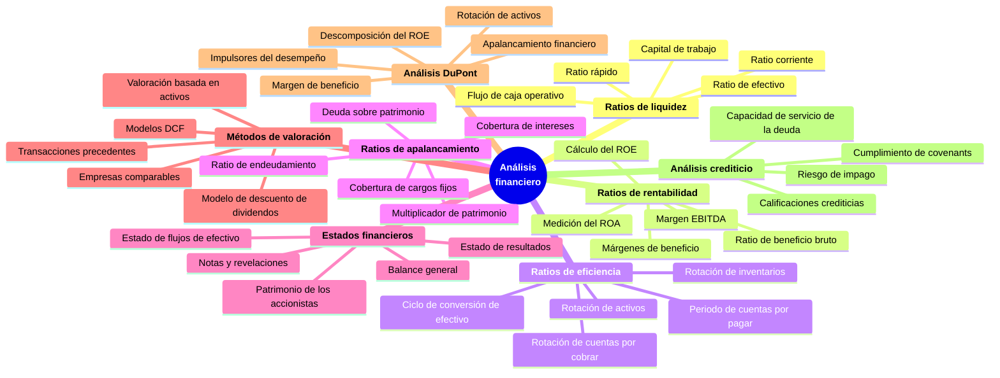

```mermaid
mindmap
  root((<b>Análisis<br>financiero</b>))
    <b>Ratios de liquidez</b>
      Ratio corriente
      Ratio rápido
      Ratio de efectivo
      Capital de trabajo
      Flujo de caja operativo
    <b>Ratios de rentabilidad</b>
      Cálculo del ROE
      Medición del ROA
      Márgenes de beneficio
      Margen EBITDA
      Ratio de beneficio bruto
    <b>Ratios de eficiencia</b>
      Rotación de activos
      Rotación de inventarios
      Rotación de cuentas por cobrar
      Periodo de cuentas por pagar
      Ciclo de conversión de efectivo
    <b>Ratios de apalancamiento</b>
      Deuda sobre patrimonio
      Cobertura de intereses
      Ratio de endeudamiento
      Multiplicador de patrimonio
      Cobertura de cargos fijos
    <b>Estados financieros</b>
      Balance general
      Estado de resultados
      Estado de flujos de efectivo
      Patrimonio de los accionistas
      Notas y revelaciones
    <b>Métodos de valoración</b>
      Modelos DCF
      Empresas comparables
      Transacciones precedentes
      Valoración basada en activos
      Modelo de descuento de dividendos
    <b>Análisis DuPont</b>
      Descomposición del ROE
      Margen de beneficio
      Rotación de activos
      Apalancamiento financiero
      Impulsores del desempeño
    <b>Análisis crediticio</b>
      Riesgo de impago
      Calificaciones crediticias
      Capacidad de servicio de la deuda
      Cumplimiento de covenants
```
