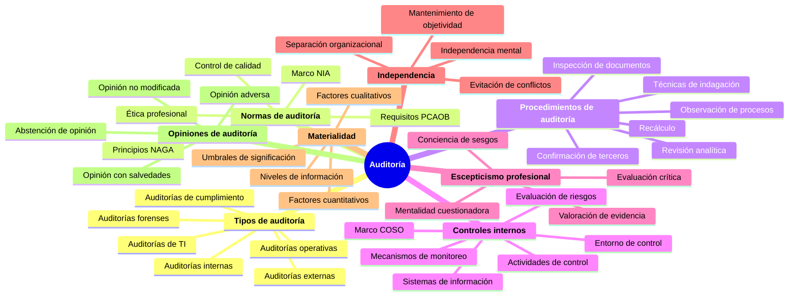

```mermaid
mindmap
  root((<b>Auditoría</b>))
    <b>Tipos de auditoría</b>
      Auditorías externas
      Auditorías internas
      Auditorías de cumplimiento
      Auditorías forenses
      Auditorías operativas
      Auditorías de TI
    <b>Normas de auditoría</b>
      Principios NAGA
      Marco NIA
      Requisitos PCAOB
      Ética profesional
      Control de calidad
    <b>Procedimientos de auditoría</b>
      Inspección de documentos
      Observación de procesos
      Confirmación de terceros
      Recálculo
      Revisión analítica
      Técnicas de indagación
    <b>Controles internos</b>
      Entorno de control
      Evaluación de riesgos
      Sistemas de información
      Actividades de control
      Mecanismos de monitoreo
      Marco COSO
    <b>Escepticismo profesional</b>
      Mentalidad cuestionadora
      Evaluación crítica
      Valoración de evidencia
      Conciencia de sesgos
    <b>Independencia</b>
      Separación organizacional
      Independencia mental
      Evitación de conflictos
      Mantenimiento de objetividad
    <b>Materialidad</b>
      Umbrales de significación
      Factores cuantitativos
      Factores cualitativos
      Niveles de información
    <b>Opiniones de auditoría</b>
      Opinión no modificada
      Opinión con salvedades
      Opinión adversa
      Abstención de opinión
```
