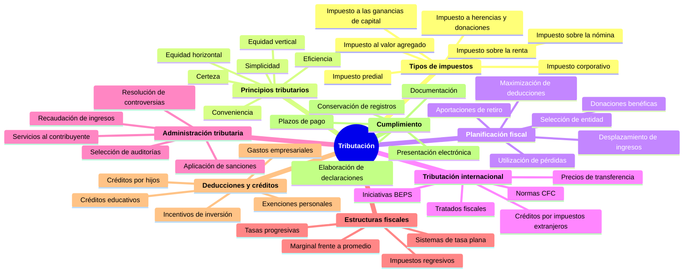

```mermaid
mindmap
  root((<b>Tributación</b>))
    <b>Tipos de impuestos</b>
      Impuesto sobre la renta
      Impuesto corporativo
      Impuesto al valor agregado
      Impuesto predial
      Impuesto a las ganancias de capital
      Impuesto a herencias y donaciones
      Impuesto sobre la nómina
    <b>Principios tributarios</b>
      Equidad horizontal
      Equidad vertical
      Eficiencia
      Simplicidad
      Certeza
      Conveniencia
    <b>Planificación fiscal</b>
      Desplazamiento de ingresos
      Maximización de deducciones
      Selección de entidad
      Aportaciones de retiro
      Donaciones benéficas
      Utilización de pérdidas
    <b>Tributación internacional</b>
      Precios de transferencia
      Tratados fiscales
      Créditos por impuestos extranjeros
      Normas CFC
      Iniciativas BEPS
    <b>Administración tributaria</b>
      Recaudación de ingresos
      Servicios al contribuyente
      Selección de auditorías
      Resolución de controversias
      Aplicación de sanciones
    <b>Estructuras fiscales</b>
      Tasas progresivas
      Sistemas de tasa plana
      Impuestos regresivos
      Marginal frente a promedio
    <b>Deducciones y créditos</b>
      Gastos empresariales
      Incentivos de inversión
      Exenciones personales
      Créditos educativos
      Créditos por hijos
    <b>Cumplimiento</b>
      Elaboración de declaraciones
      Documentación
      Conservación de registros
      Plazos de pago
      Presentación electrónica
```
