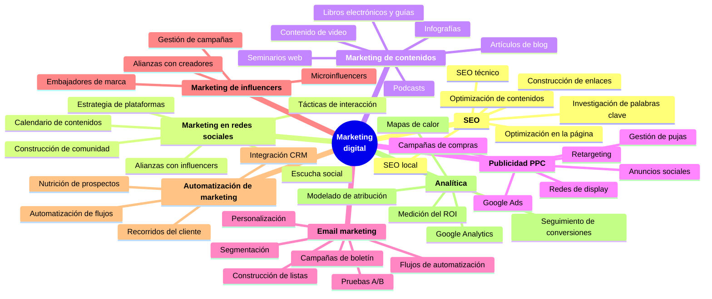

```mermaid
mindmap
  root((<b>Marketing<br>digital</b>))
    <b>SEO</b>
      Investigación de palabras clave
      Optimización en la página
      SEO técnico
      Construcción de enlaces
      SEO local
      Optimización de contenidos
    <b>Marketing en redes sociales</b>
      Estrategia de plataformas
      Construcción de comunidad
      Calendario de contenidos
      Tácticas de interacción
      Escucha social
      Alianzas con influencers
    <b>Marketing de contenidos</b>
      Artículos de blog
      Contenido de video
      Podcasts
      Infografías
      Libros electrónicos y guías
      Seminarios web
    <b>Publicidad PPC</b>
      Google Ads
      Anuncios sociales
      Redes de display
      Retargeting
      Campañas de compras
      Gestión de pujas
    <b>Email marketing</b>
      Segmentación
      Flujos de automatización
      Personalización
      Pruebas A/B
      Construcción de listas
      Campañas de boletín
    <b>Marketing de influencers</b>
      Alianzas con creadores
      Embajadores de marca
      Microinfluencers
      Gestión de campañas
    <b>Automatización de marketing</b>
      Nutrición de prospectos
      Recorridos del cliente
      Automatización de flujos
      Integración CRM
    <b>Analítica</b>
      Google Analytics
      Seguimiento de conversiones
      Modelado de atribución
      Medición del ROI
      Mapas de calor
```
