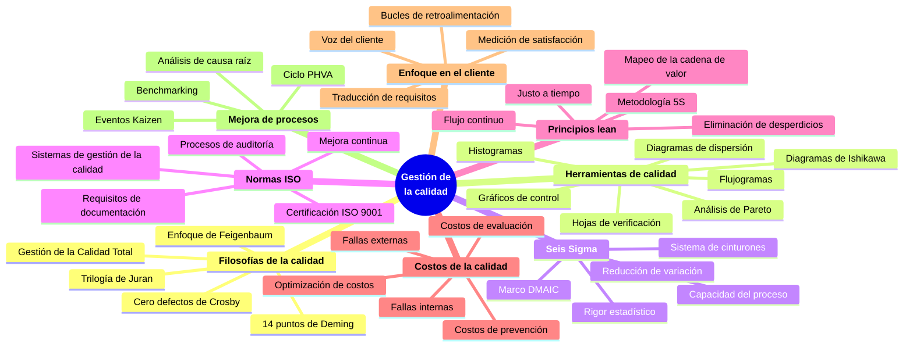

```mermaid
mindmap
  root((<b>Gestión de<br>la calidad</b>))
    <b>Filosofías de la calidad</b>
      Gestión de la Calidad Total
      14 puntos de Deming
      Trilogía de Juran
      Cero defectos de Crosby
      Enfoque de Feigenbaum
    <b>Herramientas de calidad</b>
      Gráficos de control
      Análisis de Pareto
      Diagramas de Ishikawa
      Flujogramas
      Hojas de verificación
      Histogramas
      Diagramas de dispersión
    <b>Seis Sigma</b>
      Marco DMAIC
      Rigor estadístico
      Sistema de cinturones
      Reducción de variación
      Capacidad del proceso
    <b>Normas ISO</b>
      Certificación ISO 9001
      Sistemas de gestión de la calidad
      Requisitos de documentación
      Procesos de auditoría
      Mejora continua
    <b>Principios lean</b>
      Eliminación de desperdicios
      Mapeo de la cadena de valor
      Justo a tiempo
      Flujo continuo
      Metodología 5S
    <b>Costos de la calidad</b>
      Costos de prevención
      Costos de evaluación
      Fallas internas
      Fallas externas
      Optimización de costos
    <b>Enfoque en el cliente</b>
      Voz del cliente
      Medición de satisfacción
      Traducción de requisitos
      Bucles de retroalimentación
    <b>Mejora de procesos</b>
      Eventos Kaizen
      Ciclo PHVA
      Análisis de causa raíz
      Benchmarking
```
