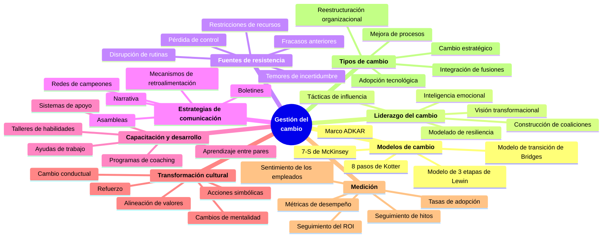

```mermaid
mindmap
  root((<b>Gestión del<br>cambio</b>))
    <b>Modelos de cambio</b>
      Modelo de 3 etapas de Lewin
      8 pasos de Kotter
      Marco ADKAR
      7-S de McKinsey
      Modelo de transición de Bridges
    <b>Liderazgo del cambio</b>
      Visión transformacional
      Inteligencia emocional
      Construcción de coaliciones
      Modelado de resiliencia
      Tácticas de influencia
    <b>Fuentes de resistencia</b>
      Pérdida de control
      Temores de incertidumbre
      Disrupción de rutinas
      Fracasos anteriores
      Restricciones de recursos
    <b>Estrategias de comunicación</b>
      Asambleas
      Boletines
      Redes de campeones
      Mecanismos de retroalimentación
      Narrativa
    <b>Capacitación y desarrollo</b>
      Talleres de habilidades
      Programas de coaching
      Ayudas de trabajo
      Sistemas de apoyo
      Aprendizaje entre pares
    <b>Transformación cultural</b>
      Cambios de mentalidad
      Alineación de valores
      Cambio conductual
      Acciones simbólicas
      Refuerzo
    <b>Medición</b>
      Tasas de adopción
      Métricas de desempeño
      Sentimiento de los empleados
      Seguimiento del ROI
      Seguimiento de hitos
    <b>Tipos de cambio</b>
      Cambio estratégico
      Mejora de procesos
      Adopción tecnológica
      Reestructuración organizacional
      Integración de fusiones
```
