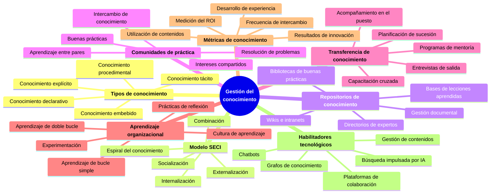

```mermaid
mindmap
  root((<b>Gestión del<br>conocimiento</b>))
    <b>Tipos de conocimiento</b>
      Conocimiento explícito
      Conocimiento tácito
      Conocimiento embebido
      Conocimiento procedimental
      Conocimiento declarativo
    <b>Modelo SECI</b>
      Socialización
      Externalización
      Combinación
      Internalización
      Espiral del conocimiento
    <b>Repositorios de conocimiento</b>
      Gestión documental
      Wikis e intranets
      Bases de lecciones aprendidas
      Directorios de expertos
      Bibliotecas de buenas prácticas
    <b>Comunidades de práctica</b>
      Intereses compartidos
      Intercambio de conocimiento
      Resolución de problemas
      Buenas prácticas
      Aprendizaje entre pares
    <b>Transferencia de conocimiento</b>
      Programas de mentoría
      Acompañamiento en el puesto
      Entrevistas de salida
      Planificación de sucesión
      Capacitación cruzada
    <b>Aprendizaje organizacional</b>
      Aprendizaje de bucle simple
      Aprendizaje de doble bucle
      Cultura de aprendizaje
      Experimentación
      Prácticas de reflexión
    <b>Métricas de conocimiento</b>
      Frecuencia de intercambio
      Utilización de contenidos
      Desarrollo de experiencia
      Resultados de innovación
      Medición del ROI
    <b>Habilitadores tecnológicos</b>
      Plataformas de colaboración
      Búsqueda impulsada por IA
      Chatbots
      Grafos de conocimiento
      Gestión de contenidos
```
