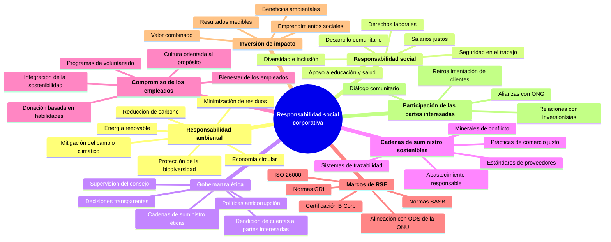

```mermaid
mindmap
  root((<b>Responsabilidad social<br>corporativa</b>))
    <b>Responsabilidad ambiental</b>
      Mitigación del cambio climático
      Reducción de carbono
      Energía renovable
      Economía circular
      Minimización de residuos
      Protección de la biodiversidad
    <b>Responsabilidad social</b>
      Derechos laborales
      Seguridad en el trabajo
      Diversidad e inclusión
      Salarios justos
      Desarrollo comunitario
      Apoyo a educación y salud
    <b>Gobernanza ética</b>
      Supervisión del consejo
      Políticas anticorrupción
      Decisiones transparentes
      Rendición de cuentas a partes interesadas
      Cadenas de suministro éticas
    <b>Cadenas de suministro sostenibles</b>
      Abastecimiento responsable
      Estándares de proveedores
      Minerales de conflicto
      Prácticas de comercio justo
      Sistemas de trazabilidad
    <b>Compromiso de los empleados</b>
      Cultura orientada al propósito
      Programas de voluntariado
      Donación basada en habilidades
      Integración de la sostenibilidad
      Bienestar de los empleados
    <b>Marcos de RSE</b>
      Normas GRI
      Alineación con ODS de la ONU
      ISO 26000
      Certificación B Corp
      Normas SASB
    <b>Inversión de impacto</b>
      Emprendimientos sociales
      Beneficios ambientales
      Resultados medibles
      Valor combinado
    <b>Participación de las partes interesadas</b>
      Diálogo comunitario
      Retroalimentación de clientes
      Relaciones con inversionistas
      Alianzas con ONG
```
