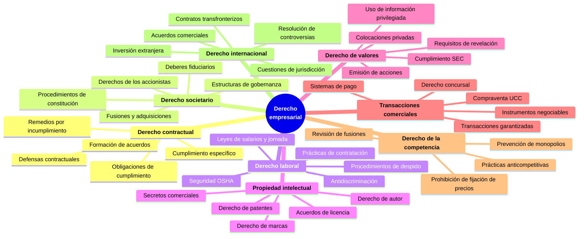

```mermaid
mindmap
  root((<b>Derecho<br>empresarial</b>))
    <b>Derecho contractual</b>
      Formación de acuerdos
      Obligaciones de cumplimiento
      Remedios por incumplimiento
      Cumplimiento específico
      Defensas contractuales
    <b>Derecho societario</b>
      Procedimientos de constitución
      Estructuras de gobernanza
      Deberes fiduciarios
      Derechos de los accionistas
      Fusiones y adquisiciones
    <b>Derecho laboral</b>
      Prácticas de contratación
      Leyes de salarios y jornada
      Seguridad OSHA
      Antidiscriminación
      Procedimientos de despido
    <b>Propiedad intelectual</b>
      Derecho de patentes
      Derecho de marcas
      Derecho de autor
      Secretos comerciales
      Acuerdos de licencia
    <b>Derecho de valores</b>
      Emisión de acciones
      Requisitos de revelación
      Uso de información privilegiada
      Cumplimiento SEC
      Colocaciones privadas
    <b>Transacciones comerciales</b>
      Compraventa UCC
      Instrumentos negociables
      Transacciones garantizadas
      Derecho concursal
      Sistemas de pago
    <b>Derecho de la competencia</b>
      Prevención de monopolios
      Prohibición de fijación de precios
      Prácticas anticompetitivas
      Revisión de fusiones
    <b>Derecho internacional</b>
      Contratos transfronterizos
      Acuerdos comerciales
      Resolución de controversias
      Cuestiones de jurisdicción
      Inversión extranjera
```
