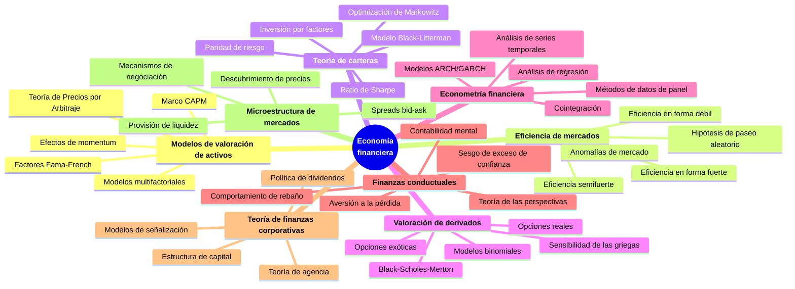

```mermaid
mindmap
  root((<b>Economía<br>financiera</b>))
    <b>Modelos de valoración de activos</b>
      Marco CAPM
      Teoría de Precios por Arbitraje
      Factores Fama-French
      Modelos multifactoriales
      Efectos de momentum
    <b>Eficiencia de mercados</b>
      Eficiencia en forma débil
      Eficiencia semifuerte
      Eficiencia en forma fuerte
      Hipótesis de paseo aleatorio
      Anomalías de mercado
    <b>Teoría de carteras</b>
      Optimización de Markowitz
      Ratio de Sharpe
      Modelo Black-Litterman
      Paridad de riesgo
      Inversión por factores
    <b>Valoración de derivados</b>
      Black-Scholes-Merton
      Modelos binomiales
      Opciones reales
      Opciones exóticas
      Sensibilidad de las griegas
    <b>Econometría financiera</b>
      Análisis de series temporales
      Modelos ARCH/GARCH
      Cointegración
      Métodos de datos de panel
      Análisis de regresión
    <b>Finanzas conductuales</b>
      Sesgo de exceso de confianza
      Aversión a la pérdida
      Comportamiento de rebaño
      Contabilidad mental
      Teoría de las perspectivas
    <b>Teoría de finanzas corporativas</b>
      Estructura de capital
      Política de dividendos
      Teoría de agencia
      Modelos de señalización
    <b>Microestructura de mercados</b>
      Spreads bid-ask
      Provisión de liquidez
      Descubrimiento de precios
      Mecanismos de negociación
```
