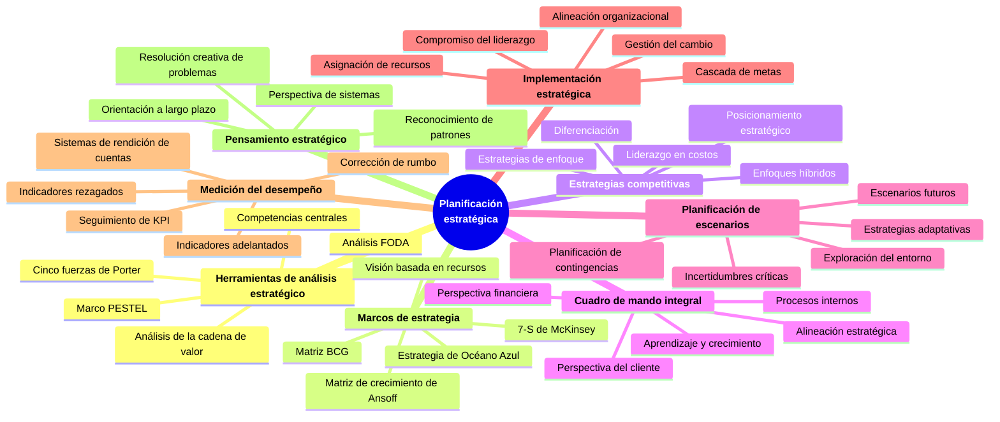

```mermaid
mindmap
  root((<b>Planificación<br>estratégica</b>))
    <b>Herramientas de análisis estratégico</b>
      Análisis FODA
      Cinco fuerzas de Porter
      Marco PESTEL
      Análisis de la cadena de valor
      Competencias centrales
    <b>Marcos de estrategia</b>
      Matriz de crecimiento de Ansoff
      Matriz BCG
      7-S de McKinsey
      Estrategia de Océano Azul
      Visión basada en recursos
    <b>Estrategias competitivas</b>
      Liderazgo en costos
      Diferenciación
      Estrategias de enfoque
      Enfoques híbridos
      Posicionamiento estratégico
    <b>Cuadro de mando integral</b>
      Perspectiva financiera
      Perspectiva del cliente
      Procesos internos
      Aprendizaje y crecimiento
      Alineación estratégica
    <b>Planificación de escenarios</b>
      Escenarios futuros
      Incertidumbres críticas
      Estrategias adaptativas
      Planificación de contingencias
      Exploración del entorno
    <b>Implementación estratégica</b>
      Cascada de metas
      Asignación de recursos
      Alineación organizacional
      Gestión del cambio
      Compromiso del liderazgo
    <b>Medición del desempeño</b>
      Indicadores adelantados
      Indicadores rezagados
      Sistemas de rendición de cuentas
      Corrección de rumbo
      Seguimiento de KPI
    <b>Pensamiento estratégico</b>
      Perspectiva de sistemas
      Orientación a largo plazo
      Resolución creativa de problemas
      Reconocimiento de patrones
```
