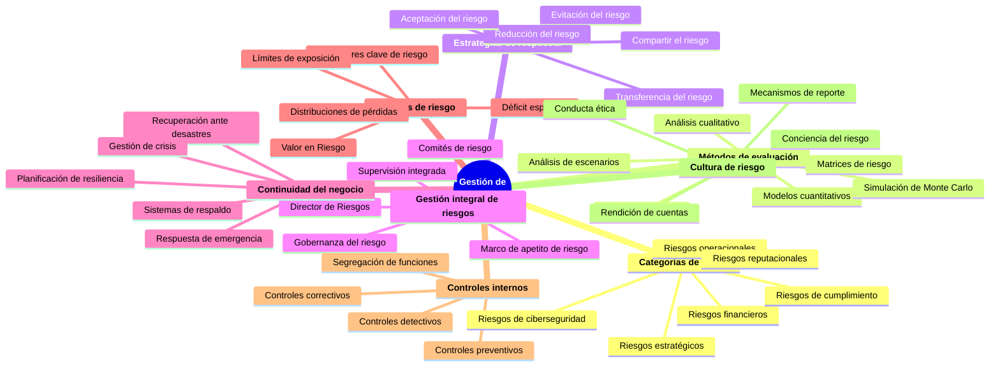

```mermaid
mindmap
  root((<b>Gestión de<br>riesgos</b>))
    <b>Categorías de riesgo</b>
      Riesgos estratégicos
      Riesgos operacionales
      Riesgos financieros
      Riesgos de cumplimiento
      Riesgos reputacionales
      Riesgos de ciberseguridad
    <b>Métodos de evaluación</b>
      Análisis cualitativo
      Modelos cuantitativos
      Análisis de escenarios
      Pruebas de estrés
      Matrices de riesgo
      Simulación de Monte Carlo
    <b>Estrategias de respuesta</b>
      Evitación del riesgo
      Reducción del riesgo
      Transferencia del riesgo
      Aceptación del riesgo
      Compartir el riesgo
    <b>Gestión integral de riesgos</b>
      Marco de apetito de riesgo
      Gobernanza del riesgo
      Director de Riesgos
      Comités de riesgo
      Supervisión integrada
    <b>Continuidad del negocio</b>
      Recuperación ante desastres
      Gestión de crisis
      Sistemas de respaldo
      Respuesta de emergencia
      Planificación de resiliencia
    <b>Métricas de riesgo</b>
      Valor en Riesgo
      Déficit esperado
      Indicadores clave de riesgo
      Distribuciones de pérdidas
      Límites de exposición
    <b>Controles internos</b>
      Controles preventivos
      Controles detectivos
      Controles correctivos
      Segregación de funciones
    <b>Cultura de riesgo</b>
      Conciencia del riesgo
      Rendición de cuentas
      Conducta ética
      Mecanismos de reporte
```
