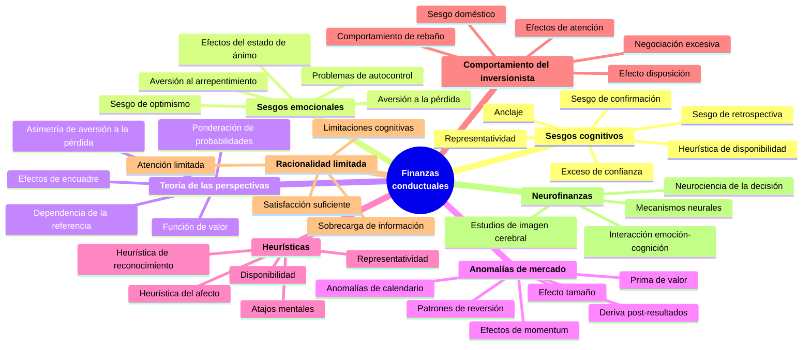

```mermaid
mindmap
  root((<b>Finanzas<br>conductuales</b>))
    <b>Sesgos cognitivos</b>
      Exceso de confianza
      Anclaje
      Sesgo de confirmación
      Heurística de disponibilidad
      Representatividad
      Sesgo de retrospectiva
    <b>Sesgos emocionales</b>
      Aversión a la pérdida
      Aversión al arrepentimiento
      Problemas de autocontrol
      Efectos del estado de ánimo
      Sesgo de optimismo
    <b>Teoría de las perspectivas</b>
      Dependencia de la referencia
      Asimetría de aversión a la pérdida
      Ponderación de probabilidades
      Efectos de encuadre
      Función de valor
    <b>Anomalías de mercado</b>
      Efectos de momentum
      Prima de valor
      Efecto tamaño
      Anomalías de calendario
      Deriva post-resultados
      Patrones de reversión
    <b>Heurísticas</b>
      Representatividad
      Disponibilidad
      Heurística del afecto
      Heurística de reconocimiento
      Atajos mentales
    <b>Comportamiento del inversionista</b>
      Efecto disposición
      Comportamiento de rebaño
      Negociación excesiva
      Sesgo doméstico
      Efectos de atención
    <b>Racionalidad limitada</b>
      Limitaciones cognitivas
      Satisfacción suficiente
      Atención limitada
      Sobrecarga de información
    <b>Neurofinanzas</b>
      Estudios de imagen cerebral
      Mecanismos neurales
      Interacción emoción-cognición
      Neurociencia de la decisión
```
