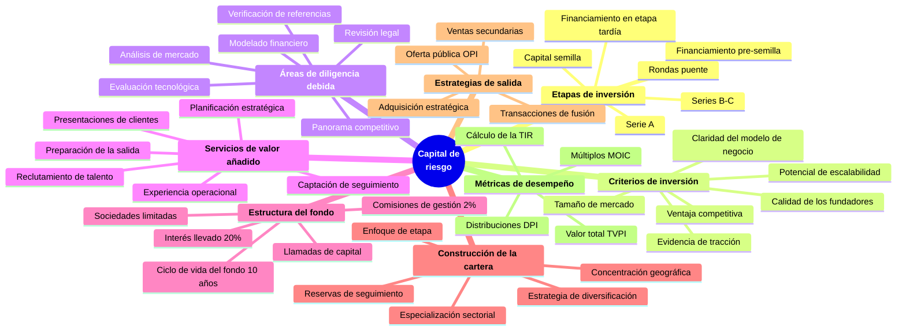

```mermaid
mindmap
  root((<b>Capital de<br>riesgo</b>))
    <b>Etapas de inversión</b>
      Financiamiento pre-semilla
      Capital semilla
      Serie A
      Series B-C
      Financiamiento en etapa tardía
      Rondas puente
    <b>Criterios de inversión</b>
      Calidad de los fundadores
      Tamaño de mercado
      Ventaja competitiva
      Claridad del modelo de negocio
      Evidencia de tracción
      Potencial de escalabilidad
    <b>Áreas de diligencia debida</b>
      Evaluación tecnológica
      Análisis de mercado
      Panorama competitivo
      Modelado financiero
      Revisión legal
      Verificación de referencias
    <b>Servicios de valor añadido</b>
      Planificación estratégica
      Experiencia operacional
      Reclutamiento de talento
      Presentaciones de clientes
      Captación de seguimiento
      Preparación de la salida
    <b>Estructura del fondo</b>
      Sociedades limitadas
      Comisiones de gestión 2%
      Interés llevado 20%
      Ciclo de vida del fondo 10 años
      Llamadas de capital
    <b>Construcción de la cartera</b>
      Estrategia de diversificación
      Enfoque de etapa
      Especialización sectorial
      Concentración geográfica
      Reservas de seguimiento
    <b>Estrategias de salida</b>
      Oferta pública OPI
      Adquisición estratégica
      Ventas secundarias
      Transacciones de fusión
    <b>Métricas de desempeño</b>
      Cálculo de la TIR
      Múltiplos MOIC
      Distribuciones DPI
      Valor total TVPI
```
