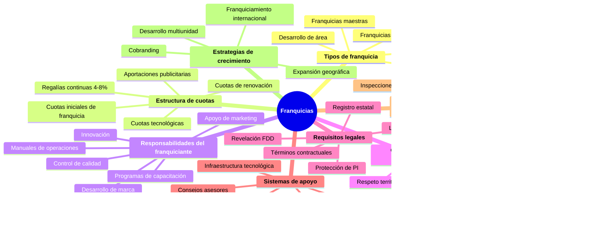

```mermaid
mindmap
  root((<b>Franquicias</b>))
    <b>Tipos de franquicia</b>
      Distribución de producto
      Formato de negocio
      Franquicias maestras
      Franquicias de conversión
      Desarrollo de área
    <b>Estructura de cuotas</b>
      Cuotas iniciales de franquicia
      Regalías continuas 4-8%
      Aportaciones publicitarias
      Cuotas tecnológicas
      Cuotas de renovación
    <b>Responsabilidades del franquiciante</b>
      Desarrollo de marca
      Manuales de operaciones
      Programas de capacitación
      Apoyo de marketing
      Control de calidad
      Innovación
    <b>Obligaciones del franquiciatario</b>
      Inversión inicial
      Estándares operativos
      Respeto territorial
      Mantenimiento de la calidad
      Cumplimiento de reportes
      Pago de cuotas
    <b>Requisitos legales</b>
      Revelación FDD
      Registro estatal
      Leyes de relación
      Protección de PI
      Términos contractuales
    <b>Sistemas de apoyo</b>
      Representantes de campo
      Plataformas de aprendizaje
      Redes de proveedores
      Infraestructura tecnológica
      Consejos asesores
    <b>Aseguramiento de la calidad</b>
      Cliente misterioso
      Inspecciones regulares
      Retroalimentación de clientes
      Auditorías de marca
      Monitoreo de cumplimiento
    <b>Estrategias de crecimiento</b>
      Expansión geográfica
      Desarrollo multiunidad
      Franquiciamiento internacional
      Cobranding
```
