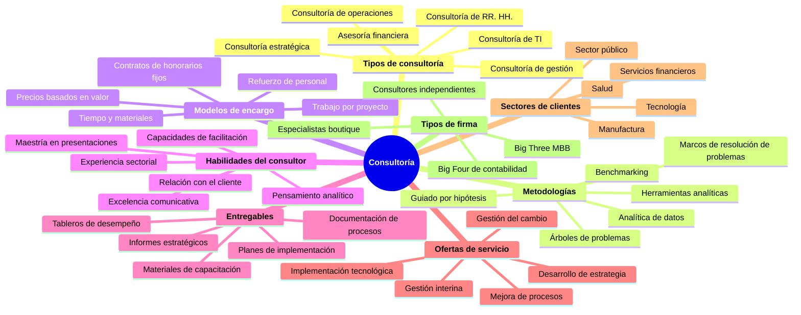

```mermaid
mindmap
  root((<b>Consultoría</b>))
    <b>Tipos de consultoría</b>
      Consultoría estratégica
      Consultoría de gestión
      Consultoría de TI
      Consultoría de RR. HH.
      Consultoría de operaciones
      Asesoría financiera
    <b>Metodologías</b>
      Marcos de resolución de problemas
      Árboles de problemas
      Guiado por hipótesis
      Herramientas analíticas
      Benchmarking
      Analítica de datos
    <b>Modelos de encargo</b>
      Trabajo por proyecto
      Contratos de honorarios fijos
      Refuerzo de personal
      Precios basados en valor
      Tiempo y materiales
    <b>Habilidades del consultor</b>
      Pensamiento analítico
      Excelencia comunicativa
      Experiencia sectorial
      Capacidades de facilitación
      Relación con el cliente
      Maestría en presentaciones
    <b>Entregables</b>
      Informes estratégicos
      Planes de implementación
      Materiales de capacitación
      Tableros de desempeño
      Documentación de procesos
    <b>Ofertas de servicio</b>
      Desarrollo de estrategia
      Mejora de procesos
      Gestión del cambio
      Implementación tecnológica
      Gestión interina
    <b>Sectores de clientes</b>
      Salud
      Servicios financieros
      Manufactura
      Tecnología
      Sector público
    <b>Tipos de firma</b>
      Big Three MBB
      Big Four de contabilidad
      Especialistas boutique
      Consultores independientes
```
