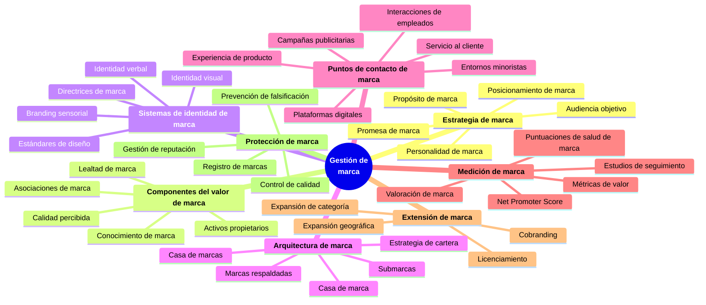

```mermaid
mindmap
  root((<b>Gestión de<br>marca</b>))
    <b>Estrategia de marca</b>
      Posicionamiento de marca
      Personalidad de marca
      Propósito de marca
      Promesa de marca
      Audiencia objetivo
    <b>Componentes del valor de marca</b>
      Conocimiento de marca
      Asociaciones de marca
      Calidad percibida
      Lealtad de marca
      Activos propietarios
    <b>Sistemas de identidad de marca</b>
      Identidad visual
      Identidad verbal
      Branding sensorial
      Directrices de marca
      Estándares de diseño
    <b>Arquitectura de marca</b>
      Casa de marca
      Casa de marcas
      Marcas respaldadas
      Submarcas
      Estrategia de cartera
    <b>Puntos de contacto de marca</b>
      Experiencia de producto
      Entornos minoristas
      Plataformas digitales
      Campañas publicitarias
      Servicio al cliente
      Interacciones de empleados
    <b>Medición de marca</b>
      Puntuaciones de salud de marca
      Net Promoter Score
      Valoración de marca
      Estudios de seguimiento
      Métricas de valor
    <b>Extensión de marca</b>
      Expansión de categoría
      Cobranding
      Licenciamiento
      Expansión geográfica
    <b>Protección de marca</b>
      Registro de marcas
      Prevención de falsificación
      Control de calidad
      Gestión de reputación
```
