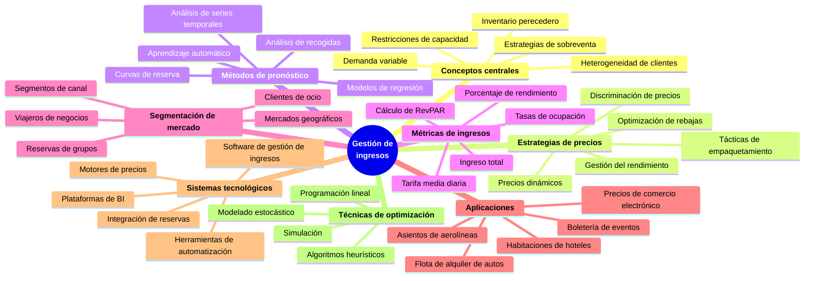

```mermaid
mindmap
  root((<b>Gestión de<br>ingresos</b>))
    <b>Conceptos centrales</b>
      Inventario perecedero
      Restricciones de capacidad
      Demanda variable
      Heterogeneidad de clientes
      Estrategias de sobreventa
    <b>Estrategias de precios</b>
      Precios dinámicos
      Gestión del rendimiento
      Discriminación de precios
      Tácticas de empaquetamiento
      Optimización de rebajas
    <b>Métodos de pronóstico</b>
      Análisis de series temporales
      Modelos de regresión
      Aprendizaje automático
      Análisis de recogidas
      Curvas de reserva
    <b>Métricas de ingresos</b>
      Cálculo de RevPAR
      Porcentaje de rendimiento
      Tarifa media diaria
      Tasas de ocupación
      Ingreso total
    <b>Segmentación de mercado</b>
      Viajeros de negocios
      Clientes de ocio
      Reservas de grupos
      Segmentos de canal
      Mercados geográficos
    <b>Aplicaciones</b>
      Asientos de aerolíneas
      Habitaciones de hoteles
      Flota de alquiler de autos
      Boletería de eventos
      Precios de comercio electrónico
    <b>Sistemas tecnológicos</b>
      Software de gestión de ingresos
      Motores de precios
      Plataformas de BI
      Integración de reservas
      Herramientas de automatización
    <b>Técnicas de optimización</b>
      Programación lineal
      Modelado estocástico
      Simulación
      Algoritmos heurísticos
```
