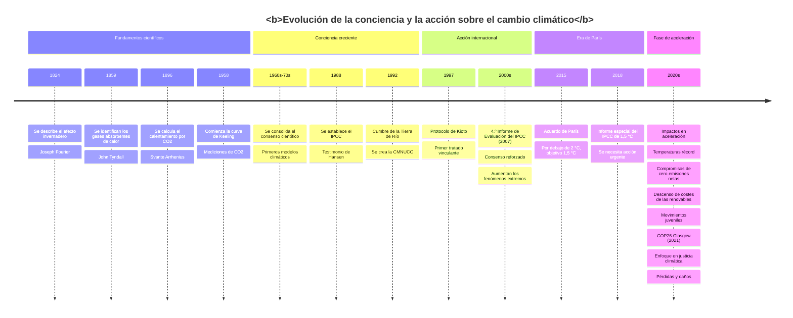

```mermaid
timeline
    title <b>Evolución de la conciencia y la acción sobre el cambio climático</b>
    
    section Fundamentos científicos
        1824  : Se describe el efecto invernadero
              : Joseph Fourier
        1859  : Se identifican los gases absorbentes de calor
              : John Tyndall
        1896  : Se calcula el calentamiento por CO2
              : Svante Arrhenius
        1958  : Comienza la curva de Keeling
              : Mediciones de CO2
    
    section Conciencia creciente
        1960s-70s : Se consolida el consenso científico
                  : Primeros modelos climáticos
        1988  : Se establece el IPCC
              : Testimonio de Hansen
        1992  : Cumbre de la Tierra de Río
              : Se crea la CMNUCC
    
    section Acción internacional
        1997  : Protocolo de Kioto
              : Primer tratado vinculante
        2000s : 4.º Informe de Evaluación del IPCC (2007)
              : Consenso reforzado
              : Aumentan los fenómenos extremos
    
    section Era de París
        2015  : Acuerdo de París
              : Por debajo de 2 °C, objetivo 1,5 °C
        2018  : Informe especial del IPCC de 1,5 °C
              : Se necesita acción urgente
    
    section Fase de aceleración
        2020s : Impactos en aceleración
              : Temperaturas récord
              : Compromisos de cero emisiones netas
              : Descenso de costes de las renovables
              : Movimientos juveniles
              : COP26 Glasgow (2021)
              : Enfoque en justicia climática
              : Pérdidas y daños
```
