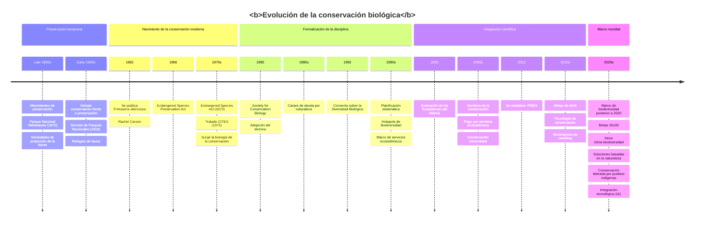

```mermaid
timeline
    title <b>Evolución de la conservación biológica</b>
    
    section Preservación temprana
        Late 1800s : Movimientos de preservación
                   : Parque Nacional Yellowstone (1872)
                   : Sociedades de protección de la fauna
        Early 1900s : Debate conservación frente a preservación
                    : Servicio de Parques Nacionales (1916)
                    : Refugios de fauna
    
    section Nacimiento de la conservación moderna
        1962  : Se publica Primavera silenciosa
              : Rachel Carson
        1966  : Endangered Species Preservation Act
        1970s : Endangered Species Act (1973)
              : Tratado CITES (1975)
              : Surge la biología de la conservación
    
    section Formalización de la disciplina
        1985  : Society for Conservation Biology
              : Adopción del término
        1980s : Canjes de deuda por naturaleza
        1992  : Convenio sobre la Diversidad Biológica
        1990s : Planificación sistemática
              : Hotspots de biodiversidad
              : Marco de servicios ecosistémicos
    
    section Integración científica
        2005  : Evaluación de los Ecosistemas del Milenio
        2000s : Genética de la conservación
              : Pago por servicios ecosistémicos
              : Conservación comunitaria
        2012  : Se establece IPBES
        2010s : Metas de Aichi
              : Tecnología de conservación
              : Movimientos de rewilding
    
    section Marco mundial
        2020s : Marco de biodiversidad posterior a 2020
              : Metas 30x30
              : Nexo clima-biodiversidad
              : Soluciones basadas en la naturaleza
              : Conservación liderada por pueblos indígenas
              : Integración tecnológica (IA)
```
