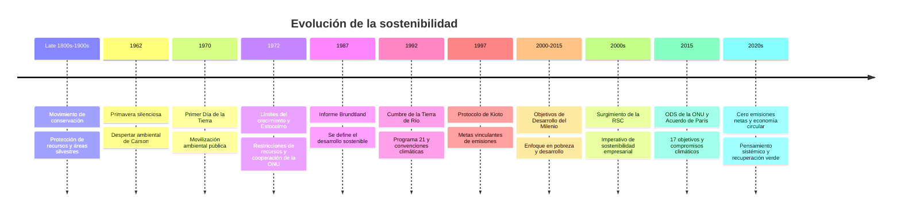

```mermaid
timeline
    title Evolución de la sostenibilidad
    Late 1800s-1900s : Movimiento de conservación
                     : Protección de recursos y áreas silvestres
    1962 : Primavera silenciosa
         : Despertar ambiental de Carson
    1970 : Primer Día de la Tierra
         : Movilización ambiental pública
    1972 : Límites del crecimiento y Estocolmo
         : Restricciones de recursos y cooperación de la ONU
    1987 : Informe Brundtland
         : Se define el desarrollo sostenible
    1992 : Cumbre de la Tierra de Río
         : Programa 21 y convenciones climáticas
    1997 : Protocolo de Kioto
         : Metas vinculantes de emisiones
    2000-2015 : Objetivos de Desarrollo del Milenio
              : Enfoque en pobreza y desarrollo
    2000s : Surgimiento de la RSC
          : Imperativo de sostenibilidad empresarial
    2015 : ODS de la ONU y Acuerdo de París
         : 17 objetivos y compromisos climáticos
    2020s : Cero emisiones netas y economía circular
          : Pensamiento sistémico y recuperación verde
```
