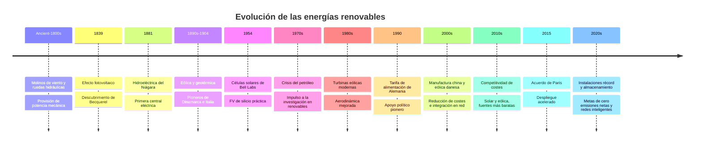

```mermaid
timeline
    title Evolución de las energías renovables
    Ancient-1800s : Molinos de viento y ruedas hidráulicas
                  : Provisión de potencia mecánica
    1839 : Efecto fotovoltaico
         : Descubrimiento de Becquerel
    1881 : Hidroeléctrica del Niágara
         : Primera central eléctrica
    1890s-1904 : Eólica y geotérmica
               : Pioneros de Dinamarca e Italia
    1954 : Células solares de Bell Labs
         : FV de silicio práctica
    1970s : Crisis del petróleo
          : Impulso a la investigación en renovables
    1980s : Turbinas eólicas modernas
          : Aerodinámica mejorada
    1990 : Tarifa de alimentación de Alemania
         : Apoyo político pionero
    2000s : Manufactura china y eólica danesa
          : Reducción de costes e integración en red
    2010s : Competitividad de costes
          : Solar y eólica, fuentes más baratas
    2015 : Acuerdo de París
         : Despliegue acelerado
    2020s : Instalaciones récord y almacenamiento
          : Metas de cero emisiones netas y redes inteligentes
```
