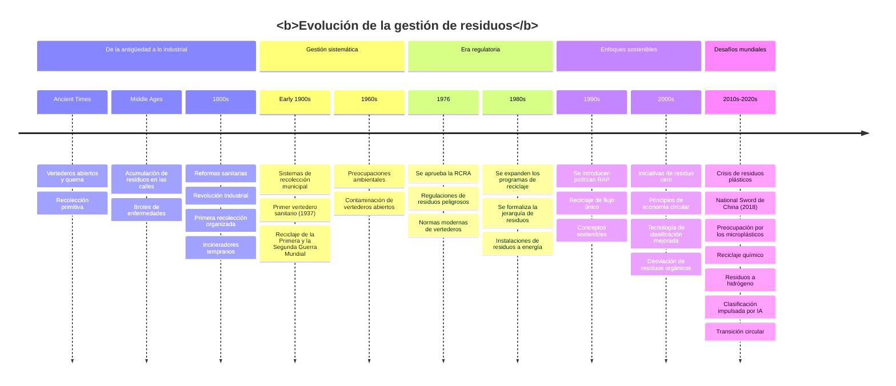

```mermaid
timeline
    title <b>Evolución de la gestión de residuos</b>
    
    section De la antigüedad a lo industrial
        Ancient Times : Vertederos abiertos y quema
                      : Recolección primitiva
        Middle Ages : Acumulación de residuos en las calles
                    : Brotes de enfermedades
        1800s : Reformas sanitarias
              : Revolución Industrial
              : Primera recolección organizada
              : Incineradores tempranos
    
    section Gestión sistemática
        Early 1900s : Sistemas de recolección municipal
                    : Primer vertedero sanitario (1937)
                    : Reciclaje de la Primera y la Segunda Guerra Mundial
        1960s : Preocupaciones ambientales
              : Contaminación de vertederos abiertos
    
    section Era regulatoria
        1976  : Se aprueba la RCRA
              : Regulaciones de residuos peligrosos
              : Normas modernas de vertederos
        1980s : Se expanden los programas de reciclaje
              : Se formaliza la jerarquía de residuos
              : Instalaciones de residuos a energía
    
    section Enfoques sostenibles
        1990s : Se introducen políticas RAP
              : Reciclaje de flujo único
              : Conceptos sostenibles
        2000s : Iniciativas de residuo cero
              : Principios de economía circular
              : Tecnología de clasificación mejorada
              : Desviación de residuos orgánicos
    
    section Desafíos mundiales
        2010s-2020s : Crisis de residuos plásticos
                    : National Sword de China (2018)
                    : Preocupación por los microplásticos
                    : Reciclaje químico
                    : Residuos a hidrógeno
                    : Clasificación impulsada por IA
                    : Transición circular
```
