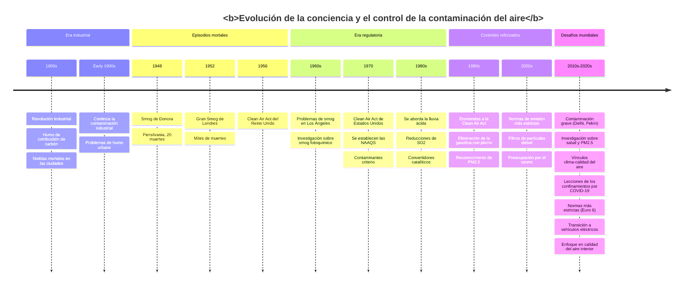

```mermaid
timeline
    title <b>Evolución de la conciencia y el control de la contaminación del aire</b>
    
    section Era industrial
        1800s : Revolución Industrial
              : Humo de combustión de carbón
              : Nieblas mortales en las ciudades
        Early 1900s : Continúa la contaminación industrial
                    : Problemas de humo urbano
    
    section Episodios mortales
        1948  : Smog de Donora
              : Pensilvania, 20 muertes
        1952  : Gran Smog de Londres
              : Miles de muertes
        1956  : Clean Air Act del Reino Unido
    
    section Era regulatoria
        1960s : Problemas de smog en Los Ángeles
              : Investigación sobre smog fotoquímico
        1970  : Clean Air Act de Estados Unidos
              : Se establecen las NAAQS
              : Contaminantes criterio
        1980s : Se aborda la lluvia ácida
              : Reducciones de SO2
              : Convertidores catalíticos
    
    section Controles reforzados
        1990s : Enmiendas a la Clean Air Act
              : Eliminación de la gasolina con plomo
              : Reconocimiento de PM2.5
        2000s : Normas de emisión más estrictas
              : Filtros de partículas diésel
              : Preocupación por el ozono
    
    section Desafíos mundiales
        2010s-2020s : Contaminación grave (Delhi, Pekín)
                    : Investigación sobre salud y PM2.5
                    : Vínculos clima-calidad del aire
                    : Lecciones de los confinamientos por COVID-19
                    : Normas más estrictas (Euro 6)
                    : Transición a vehículos eléctricos
                    : Enfoque en calidad del aire interior
```
