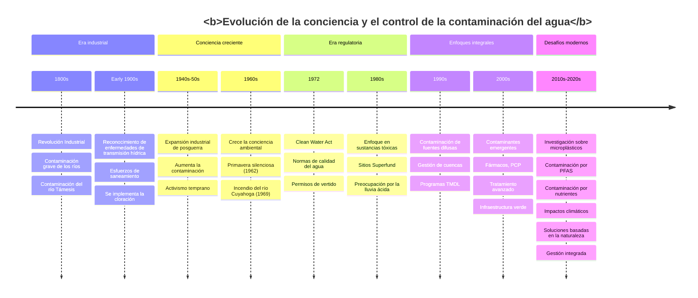

```mermaid
timeline
    title <b>Evolución de la conciencia y el control de la contaminación del agua</b>
    
    section Era industrial
        1800s : Revolución Industrial
              : Contaminación grave de los ríos
              : Contaminación del río Támesis
        Early 1900s : Reconocimiento de enfermedades de transmisión hídrica
                    : Esfuerzos de saneamiento
                    : Se implementa la cloración
    
    section Conciencia creciente
        1940s-50s : Expansión industrial de posguerra
                  : Aumenta la contaminación
                  : Activismo temprano
        1960s : Crece la conciencia ambiental
              : Primavera silenciosa (1962)
              : Incendio del río Cuyahoga (1969)
    
    section Era regulatoria
        1972  : Clean Water Act
              : Normas de calidad del agua
              : Permisos de vertido
        1980s : Enfoque en sustancias tóxicas
              : Sitios Superfund
              : Preocupación por la lluvia ácida
    
    section Enfoques integrales
        1990s : Contaminación de fuentes difusas
              : Gestión de cuencas
              : Programas TMDL
        2000s : Contaminantes emergentes
              : Fármacos, PCP
              : Tratamiento avanzado
              : Infraestructura verde
    
    section Desafíos modernos
        2010s-2020s : Investigación sobre microplásticos
                    : Contaminación por PFAS
                    : Contaminación por nutrientes
                    : Impactos climáticos
                    : Soluciones basadas en la naturaleza
                    : Gestión integrada
```
