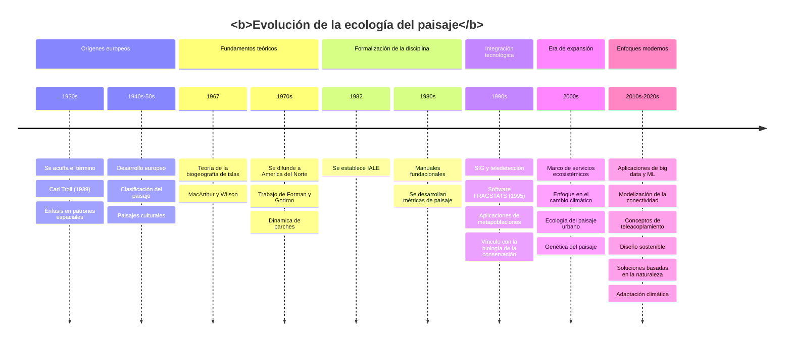

```mermaid
timeline
    title <b>Evolución de la ecología del paisaje</b>
    
    section Orígenes europeos
        1930s : Se acuña el término
              : Carl Troll (1939)
              : Énfasis en patrones espaciales
        1940s-50s : Desarrollo europeo
                  : Clasificación del paisaje
                  : Paisajes culturales
    
    section Fundamentos teóricos
        1967  : Teoría de la biogeografía de islas
              : MacArthur y Wilson
        1970s : Se difunde a América del Norte
              : Trabajo de Forman y Godron
              : Dinámica de parches
    
    section Formalización de la disciplina
        1982  : Se establece IALE
        1980s : Manuales fundacionales
              : Se desarrollan métricas de paisaje
    
    section Integración tecnológica
        1990s : SIG y teledetección
              : Software FRAGSTATS (1995)
              : Aplicaciones de metapoblaciones
              : Vínculo con la biología de la conservación
    
    section Era de expansión
        2000s : Marco de servicios ecosistémicos
              : Enfoque en el cambio climático
              : Ecología del paisaje urbano
              : Genética del paisaje
    
    section Enfoques modernos
        2010s-2020s : Aplicaciones de big data y ML
                    : Modelización de la conectividad
                    : Conceptos de teleacoplamiento
                    : Diseño sostenible
                    : Soluciones basadas en la naturaleza
                    : Adaptación climática
```
