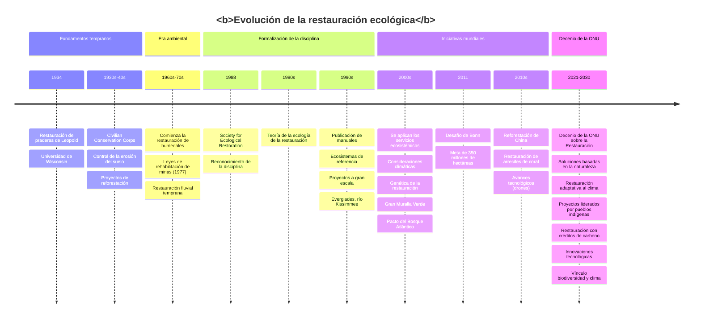

```mermaid
timeline
    title <b>Evolución de la restauración ecológica</b>
    
    section Fundamentos tempranos
        1934  : Restauración de praderas de Leopold
              : Universidad de Wisconsin
        1930s-40s : Civilian Conservation Corps
                  : Control de la erosión del suelo
                  : Proyectos de reforestación
    
    section Era ambiental
        1960s-70s : Comienza la restauración de humedales
                  : Leyes de rehabilitación de minas (1977)
                  : Restauración fluvial temprana
    
    section Formalización de la disciplina
        1988  : Society for Ecological Restoration
              : Reconocimiento de la disciplina
        1980s : Teoría de la ecología de la restauración
        1990s : Publicación de manuales
              : Ecosistemas de referencia
              : Proyectos a gran escala
              : Everglades, río Kissimmee
    
    section Iniciativas mundiales
        2000s : Se aplican los servicios ecosistémicos
              : Consideraciones climáticas
              : Genética de la restauración
              : Gran Muralla Verde
              : Pacto del Bosque Atlántico
        2011  : Desafío de Bonn
              : Meta de 350 millones de hectáreas
        2010s : Reforestación de China
              : Restauración de arrecifes de coral
              : Avances tecnológicos (drones)
    
    section Decenio de la ONU
        2021-2030 : Decenio de la ONU sobre la Restauración
                  : Soluciones basadas en la naturaleza
                  : Restauración adaptativa al clima
                  : Proyectos liderados por pueblos indígenas
                  : Restauración con créditos de carbono
                  : Innovaciones tecnológicas
                  : Vínculo biodiversidad y clima
```
