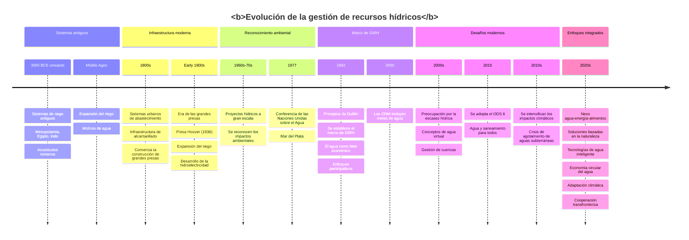

```mermaid
timeline
    title <b>Evolución de la gestión de recursos hídricos</b>
    
    section Sistemas antiguos
        3000 BCE onwards : Sistemas de riego antiguos
                         : Mesopotamia, Egipto, Indo
                         : Acueductos romanos
        Middle Ages : Expansión del riego
                    : Molinos de agua
    
    section Infraestructura moderna
        1800s : Sistemas urbanos de abastecimiento
              : Infraestructura de alcantarillado
              : Comienza la construcción de grandes presas
        Early 1900s : Era de las grandes presas
                    : Presa Hoover (1936)
                    : Expansión del riego
                    : Desarrollo de la hidroelectricidad
    
    section Reconocimiento ambiental
        1960s-70s : Proyectos hídricos a gran escala
                  : Se reconocen los impactos ambientales
        1977  : Conferencia de las Naciones Unidas sobre el Agua
              : Mar del Plata
    
    section Marco de GIRH
        1992  : Principios de Dublín
              : Se establece el marco de GIRH
              : El agua como bien económico
              : Enfoques participativos
        2000  : Los ODM incluyen metas de agua
    
    section Desafíos modernos
        2000s : Preocupación por la escasez hídrica
              : Conceptos de agua virtual
              : Gestión de cuencas
        2015  : Se adopta el ODS 6
              : Agua y saneamiento para todos
        2010s : Se intensifican los impactos climáticos
              : Crisis de agotamiento de aguas subterráneas
    
    section Enfoques integrados
        2020s : Nexo agua-energía-alimentos
              : Soluciones basadas en la naturaleza
              : Tecnologías de agua inteligente
              : Economía circular del agua
              : Adaptación climática
              : Cooperación transfronteriza
```
