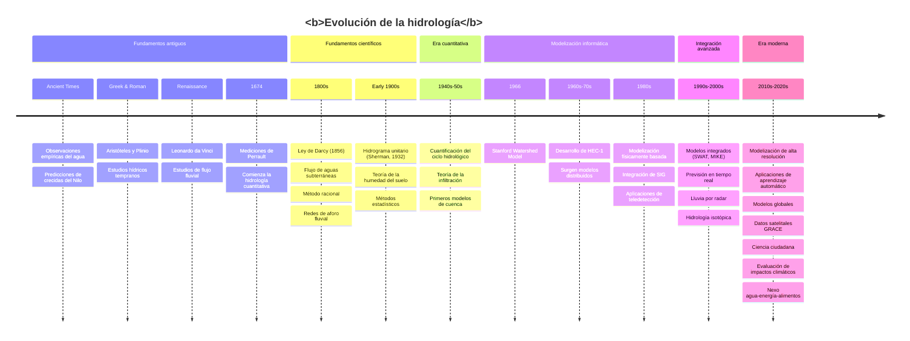

```mermaid
timeline
    title <b>Evolución de la hidrología</b>
    
    section Fundamentos antiguos
        Ancient Times : Observaciones empíricas del agua
                      : Predicciones de crecidas del Nilo
        Greek & Roman : Aristóteles y Plinio
                      : Estudios hídricos tempranos
        Renaissance : Leonardo da Vinci
                    : Estudios de flujo fluvial
        1674  : Mediciones de Perrault
              : Comienza la hidrología cuantitativa
    
    section Fundamentos científicos
        1800s : Ley de Darcy (1856)
              : Flujo de aguas subterráneas
              : Método racional
              : Redes de aforo fluvial
        Early 1900s : Hidrograma unitario (Sherman, 1932)
                    : Teoría de la humedad del suelo
                    : Métodos estadísticos
    
    section Era cuantitativa
        1940s-50s : Cuantificación del ciclo hidrológico
                  : Teoría de la infiltración
                  : Primeros modelos de cuenca
    
    section Modelización informática
        1966  : Stanford Watershed Model
        1960s-70s : Desarrollo de HEC-1
                  : Surgen modelos distribuidos
        1980s : Modelización físicamente basada
              : Integración de SIG
              : Aplicaciones de teledetección
    
    section Integración avanzada
        1990s-2000s : Modelos integrados (SWAT, MIKE)
                    : Previsión en tiempo real
                    : Lluvia por radar
                    : Hidrología isotópica
    
    section Era moderna
        2010s-2020s : Modelización de alta resolución
                    : Aplicaciones de aprendizaje automático
                    : Modelos globales
                    : Datos satelitales GRACE
                    : Ciencia ciudadana
                    : Evaluación de impactos climáticos
                    : Nexo agua-energía-alimentos
```
