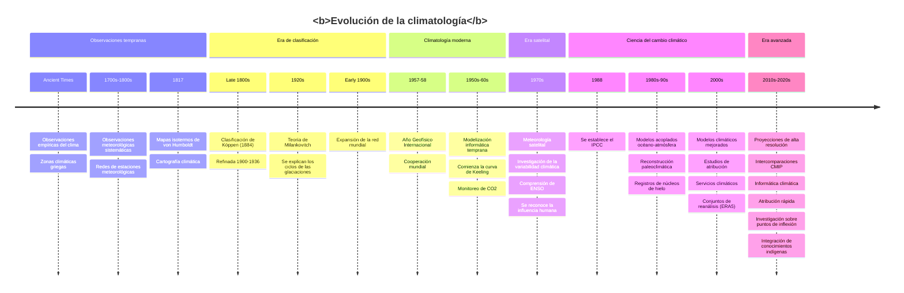

```mermaid
timeline
    title <b>Evolución de la climatología</b>
    
    section Observaciones tempranas
        Ancient Times : Observaciones empíricas del clima
                      : Zonas climáticas griegas
        1700s-1800s : Observaciones meteorológicas sistemáticas
                    : Redes de estaciones meteorológicas
        1817  : Mapas isotermos de von Humboldt
              : Cartografía climática
    
    section Era de clasificación
        Late 1800s : Clasificación de Köppen (1884)
                   : Refinada 1900-1936
        1920s : Teoría de Milankovitch
              : Se explican los ciclos de las glaciaciones
        Early 1900s : Expansión de la red mundial
    
    section Climatología moderna
        1957-58 : Año Geofísico Internacional
                : Cooperación mundial
        1950s-60s : Modelización informática temprana
                  : Comienza la curva de Keeling
                  : Monitoreo de CO2
    
    section Era satelital
        1970s : Meteorología satelital
              : Investigación de la variabilidad climática
              : Comprensión de ENSO
              : Se reconoce la influencia humana
    
    section Ciencia del cambio climático
        1988  : Se establece el IPCC
        1980s-90s : Modelos acoplados océano-atmósfera
                  : Reconstrucción paleoclimática
                  : Registros de núcleos de hielo
        2000s : Modelos climáticos mejorados
              : Estudios de atribución
              : Servicios climáticos
              : Conjuntos de reanálisis (ERA5)
    
    section Era avanzada
        2010s-2020s : Proyecciones de alta resolución
                    : Intercomparaciones CMIP
                    : Informática climática
                    : Atribución rápida
                    : Investigación sobre puntos de inflexión
                    : Integración de conocimientos indígenas
```
