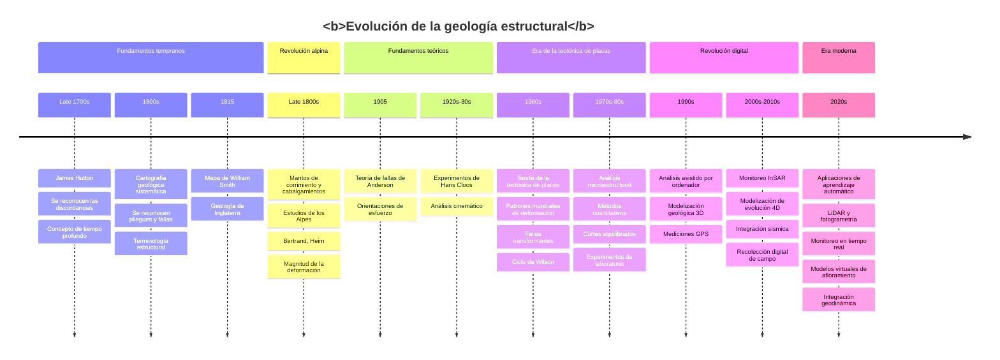

```mermaid
timeline
    title <b>Evolución de la geología estructural</b>
    
    section Fundamentos tempranos
        Late 1700s : James Hutton
                   : Se reconocen las discordancias
                   : Concepto de tiempo profundo
        1800s : Cartografía geológica sistemática
              : Se reconocen pliegues y fallas
              : Terminología estructural
        1815  : Mapa de William Smith
              : Geología de Inglaterra
    
    section Revolución alpina
        Late 1800s : Mantos de corrimiento y cabalgamientos
                   : Estudios de los Alpes
                   : Bertrand, Heim
                   : Magnitud de la deformación
    
    section Fundamentos teóricos
        1905  : Teoría de fallas de Anderson
              : Orientaciones de esfuerzo
        1920s-30s : Experimentos de Hans Cloos
                  : Análisis cinemático
    
    section Era de la tectónica de placas
        1960s : Teoría de la tectónica de placas
              : Patrones mundiales de deformación
              : Fallas transformantes
              : Ciclo de Wilson
        1970s-80s : Análisis microestructural
                  : Métodos cuantitativos
                  : Cortes equilibrados
                  : Experimentos de laboratorio
    
    section Revolución digital
        1990s : Análisis asistido por ordenador
              : Modelización geológica 3D
              : Mediciones GPS
        2000s-2010s : Monitoreo InSAR
                    : Modelización de evolución 4D
                    : Integración sísmica
                    : Recolección digital de campo
    
    section Era moderna
        2020s : Aplicaciones de aprendizaje automático
              : LiDAR y fotogrametría
              : Monitoreo en tiempo real
              : Modelos virtuales de afloramiento
              : Integración geodinámica
```
