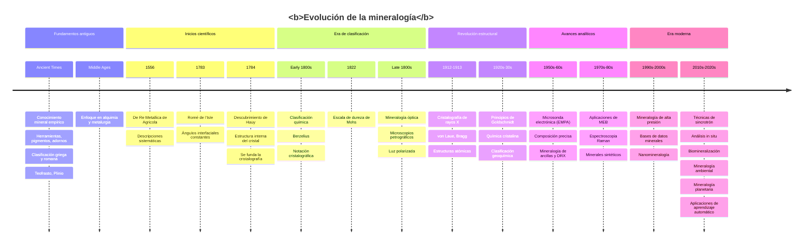

```mermaid
timeline
    title <b>Evolución de la mineralogía</b>
    
    section Fundamentos antiguos
        Ancient Times : Conocimiento mineral empírico
                      : Herramientas, pigmentos, adornos
                      : Clasificación griega y romana
                      : Teofrasto, Plinio
        Middle Ages : Enfoque en alquimia y metalurgia
    
    section Inicios científicos
        1556  : De Re Metallica de Agricola
              : Descripciones sistemáticas
        1783  : Romé de l'Isle
              : Ángulos interfaciales constantes
        1784  : Descubrimiento de Haüy
              : Estructura interna del cristal
              : Se funda la cristalografía
    
    section Era de clasificación
        Early 1800s : Clasificación química
                    : Berzelius
                    : Notación cristalográfica
        1822  : Escala de dureza de Mohs
        Late 1800s : Mineralogía óptica
                   : Microscopios petrográficos
                   : Luz polarizada
    
    section Revolución estructural
        1912-1913 : Cristalografía de rayos X
                  : von Laue, Bragg
                  : Estructuras atómicas
        1920s-30s : Principios de Goldschmidt
                  : Química cristalina
                  : Clasificación geoquímica
    
    section Avances analíticos
        1950s-60s : Microsonda electrónica (EMPA)
                  : Composición precisa
                  : Mineralogía de arcillas y DRX
        1970s-80s : Aplicaciones de MEB
                  : Espectroscopia Raman
                  : Minerales sintéticos
    
    section Era moderna
        1990s-2000s : Mineralogía de alta presión
                    : Bases de datos minerales
                    : Nanomineralogía
        2010s-2020s : Técnicas de sincrotrón
                    : Análisis in situ
                    : Biomineralización
                    : Mineralogía ambiental
                    : Mineralogía planetaria
                    : Aplicaciones de aprendizaje automático
```
