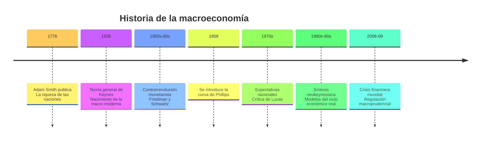

```mermaid
%%{init: {"theme": "base", "timeline": {"lineColor": "#4A6FA5", "titleColor": "#333"}}}%%
timeline
    title Historia de la macroeconomía
    1776 : Adam Smith publica<br>La riqueza de las naciones
    1936 : Teoría general de Keynes<br>Nacimiento de la macro moderna
    1950s-60s : Contrarrevolución monetarista<br>Friedman y Schwartz
    1958 : Se introduce la curva de Phillips
    1970s : Expectativas racionales<br>Crítica de Lucas
    1980s-90s : Síntesis neokeynesiana<br>Modelos del ciclo económico real
    2008-09 : Crisis financiera mundial<br>Regulación macroprudencial
```
