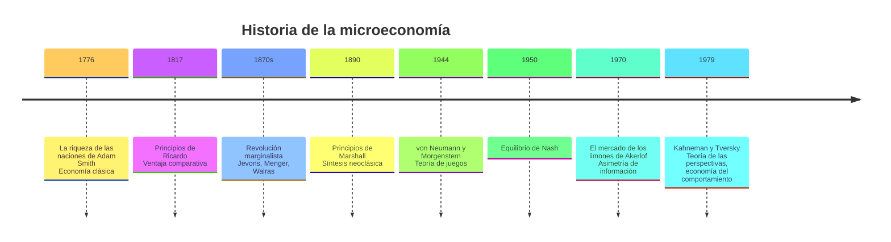

```mermaid
%%{init: {"theme": "base", "timeline": {"lineColor": "#4A6FA5", "titleColor": "#333"}}}%%
timeline
    title Historia de la microeconomía
    1776 : La riqueza de las naciones de Adam Smith<br>Economía clásica
    1817 : Principios de Ricardo<br>Ventaja comparativa
    1870s : Revolución marginalista<br>Jevons, Menger, Walras
    1890 : Principios de Marshall<br>Síntesis neoclásica
    1944 : von Neumann y Morgenstern<br>Teoría de juegos
    1950 : Equilibrio de Nash
    1970 : El mercado de los limones de Akerlof<br>Asimetría de información
    1979 : Kahneman y Tversky<br>Teoría de las perspectivas, economía del comportamiento
```
