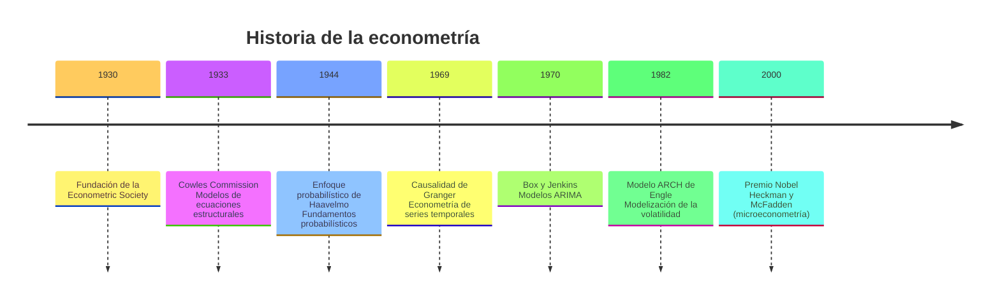

```mermaid
%%{init: {"theme": "base", "timeline": {"lineColor": "#4A6FA5", "titleColor": "#333"}}}%%
timeline
    title Historia de la econometría
    1930 : Fundación de la Econometric Society
    1933 : Cowles Commission<br>Modelos de ecuaciones estructurales
    1944 : Enfoque probabilístico de Haavelmo<br>Fundamentos probabilísticos
    1969 : Causalidad de Granger<br>Econometría de series temporales
    1970 : Box y Jenkins<br>Modelos ARIMA
    1982 : Modelo ARCH de Engle<br>Modelización de la volatilidad
    2000 : Premio Nobel<br>Heckman y McFadden (microeconometría)
```
