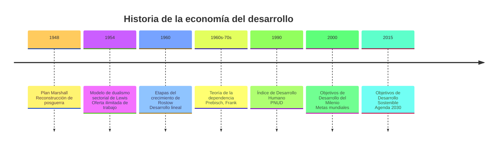

```mermaid
%%{init: {"theme": "base", "timeline": {"lineColor": "#4A6FA5", "titleColor": "#333"}}}%%
timeline
    title Historia de la economía del desarrollo
    1948 : Plan Marshall<br>Reconstrucción de posguerra
    1954 : Modelo de dualismo sectorial de Lewis<br>Oferta ilimitada de trabajo
    1960 : Etapas del crecimiento de Rostow<br>Desarrollo lineal
    1960s‑70s : Teoría de la dependencia<br>Prebisch, Frank
    1990 : Índice de Desarrollo Humano<br>PNUD
    2000 : Objetivos de Desarrollo del Milenio<br>Metas mundiales
    2015 : Objetivos de Desarrollo Sostenible<br>Agenda 2030
```
