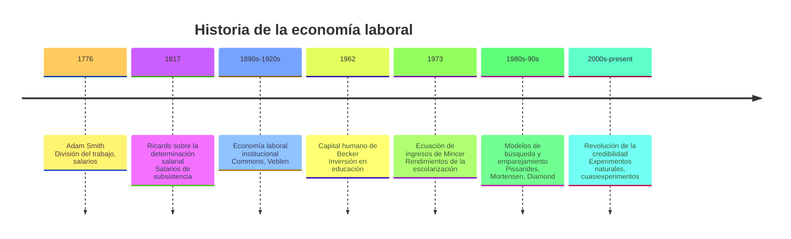

```mermaid
%%{init: {"theme": "base", "timeline": {"lineColor": "#4A6FA5", "titleColor": "#333"}}}%%
timeline
    title Historia de la economía laboral
    1776 : Adam Smith<br>División del trabajo, salarios
    1817 : Ricardo sobre la determinación salarial<br>Salarios de subsistencia
    1890s‑1920s : Economía laboral institucional<br>Commons, Veblen
    1962 : Capital humano de Becker<br>Inversión en educación
    1973 : Ecuación de ingresos de Mincer<br>Rendimientos de la escolarización
    1980s‑90s : Modelos de búsqueda y emparejamiento<br>Pissarides, Mortensen, Diamond
    2000s‑present : Revolución de la credibilidad<br>Experimentos naturales, cuasiexperimentos
```
