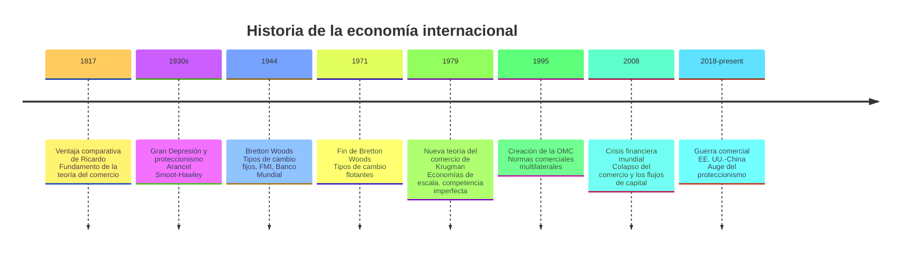

```mermaid
%%{init: {"theme": "base", "timeline": {"lineColor": "#4A6FA5", "titleColor": "#333"}}}%%
timeline
    title Historia de la economía internacional
    1817 : Ventaja comparativa de Ricardo<br>Fundamento de la teoría del comercio
    1930s : Gran Depresión y proteccionismo<br>Arancel Smoot-Hawley
    1944 : Bretton Woods<br>Tipos de cambio fijos, FMI, Banco Mundial
    1971 : Fin de Bretton Woods<br>Tipos de cambio flotantes
    1979 : Nueva teoría del comercio de Krugman<br>Economías de escala, competencia imperfecta
    1995 : Creación de la OMC<br>Normas comerciales multilaterales
    2008 : Crisis financiera mundial<br>Colapso del comercio y los flujos de capital
    2018‑present : Guerra comercial EE. UU.-China<br>Auge del proteccionismo
```
