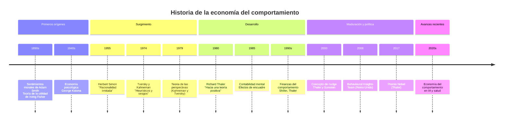

```mermaid
timeline
    title Historia de la economía del comportamiento
    section Primeros orígenes
      1890s : Sentimientos morales de Adam Smith<br>Teoría de la utilidad de Irving Fisher
      1940s : Economía psicológica<br>George Katona
    section Surgimiento
      1955 : Herbert Simon<br>"Racionalidad limitada"
      1974 : Tversky y Kahneman<br>"Heurísticos y sesgos"
      1979 : Teoría de las perspectivas<br>(Kahneman y Tversky)
    section Desarrollo
      1980 : Richard Thaler<br>"Hacia una teoría positiva"
      1985 : Contabilidad mental<br>Efectos de encuadre
      1990s : Finanzas del comportamiento<br>Shiller, Thaler
    section Maduración y política
      2000 : Concepto de nudge<br>Thaler y Sunstein
      2008 : Behavioural Insights<br>Team (Reino Unido)
      2017 : Premio Nobel<br>(Thaler)
    section Avances recientes
      2020s : Economía del comportamiento<br>en IA y salud
```
