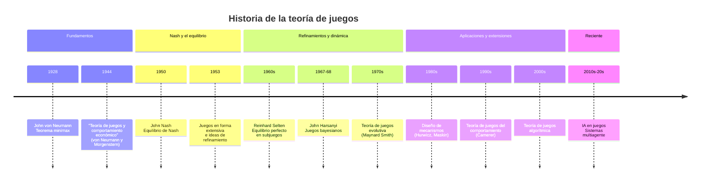

```mermaid
timeline
    title Historia de la teoría de juegos
    section Fundamentos
      1928 : John von Neumann<br>Teorema minimax
      1944 : "Teoría de juegos y<br>comportamiento económico"<br>(von Neumann y Morgenstern)
    section Nash y el equilibrio
      1950 : John Nash<br>Equilibrio de Nash
      1953 : Juegos en forma extensiva<br>e ideas de refinamiento
    section Refinamientos y dinámica
      1960s : Reinhard Selten<br>Equilibrio perfecto en subjuegos
      1967-68 : John Harsanyi<br>Juegos bayesianos
      1970s : Teoría de juegos evolutiva<br>(Maynard Smith)
    section Aplicaciones y extensiones
      1980s : Diseño de mecanismos<br>(Hurwicz, Maskin)
      1990s : Teoría de juegos del comportamiento<br>(Camerer)
      2000s : Teoría de juegos algorítmica
    section Reciente
      2010s-20s : IA en juegos<br>Sistemas multiagente
```
