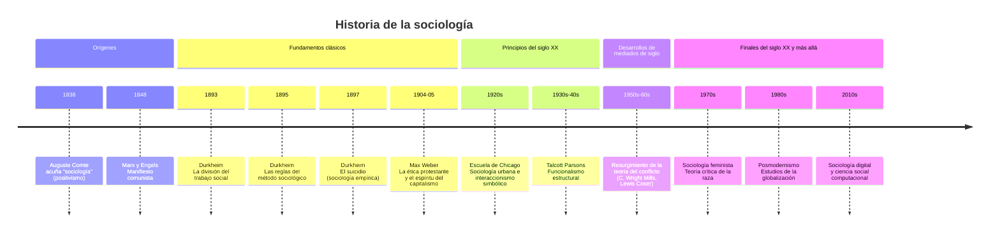

```mermaid
timeline
    title Historia de la sociología
    section Orígenes
      1838 : Auguste Comte<br>acuña "sociología" (positivismo)
      1848 : Marx y Engels<br>Manifiesto comunista
    section Fundamentos clásicos
      1893 : Durkheim<br>La división del trabajo social
      1895 : Durkheim<br>Las reglas del método sociológico
      1897 : Durkheim<br>El suicidio (sociología empírica)
      1904-05 : Max Weber<br>La ética protestante y el espíritu del capitalismo
    section Principios del siglo XX
      1920s : Escuela de Chicago<br>Sociología urbana e interaccionismo simbólico
      1930s-40s : Talcott Parsons<br>Funcionalismo estructural
    section Desarrollos de mediados de siglo
      1950s-60s : Resurgimiento de la teoría del conflicto<br>(C. Wright Mills, Lewis Coser)
    section Finales del siglo XX y más allá
      1970s : Sociología feminista<br>Teoría crítica de la raza
      1980s : Posmodernismo<br>Estudios de la globalización
      2010s : Sociología digital<br>y ciencia social computacional
```
