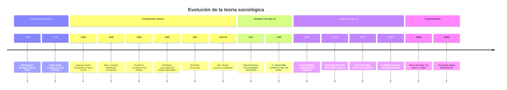

```mermaid
timeline
    title Evolución de la teoría sociológica
    section Precursores ilustrados
      1748 : Montesquieu<br>El espíritu de las leyes
      1776 : Adam Smith<br>La riqueza de las naciones
    section Fundamentos clásicos
      1838 : Auguste Comte<br>Positivismo y física social
      1848 : Marx y Engels<br>Manifiesto comunista
      1893 : Durkheim<br>La división del trabajo
      1895 : Durkheim<br>Las reglas del método sociológico
      1897 : Durkheim<br>El suicidio
      1904-05 : Max Weber<br>La ética protestante
    section Mediados del siglo XX
      1937 : Talcott Parsons<br>Funcionalismo estructural
      1959 : C. Wright Mills<br>Conflicto y élite del poder
    section Finales del siglo XX
      1959 : Erving Goffman<br>Interaccionismo simbólico
      1970s : Sociología feminista<br>Patriarcado y género
      1972 : Pierre Bourdieu<br>Teoría de la práctica
      1989 : Kimberlé Crenshaw<br>Interseccionalidad
    section Contemporánea
      1990s : Teoría del actor-red<br>Latour y Callon
      2000s : Sociología digital<br>Globalización
```
