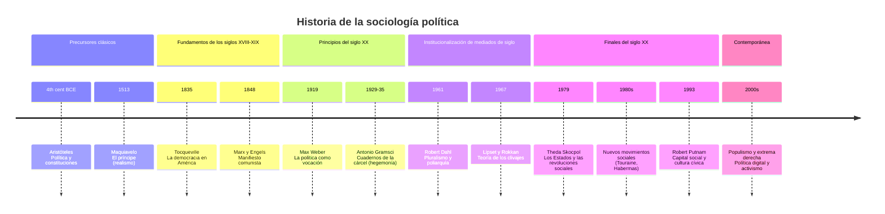

```mermaid
timeline
    title Historia de la sociología política
    section Precursores clásicos
      4th cent BCE : Aristóteles<br>Política y constituciones
      1513 : Maquiavelo<br>El príncipe (realismo)
    section Fundamentos de los siglos XVIII-XIX
      1835 : Tocqueville<br>La democracia en América
      1848 : Marx y Engels<br>Manifiesto comunista
    section Principios del siglo XX
      1919 : Max Weber<br>La política como vocación
      1929‑35 : Antonio Gramsci<br>Cuadernos de la cárcel (hegemonía)
    section Institucionalización de mediados de siglo
      1961 : Robert Dahl<br>Pluralismo y poliarquía
      1967 : Lipset y Rokkan<br>Teoría de los clivajes
    section Finales del siglo XX
      1979 : Theda Skocpol<br>Los Estados y las revoluciones sociales
      1980s : Nuevos movimientos sociales<br>(Touraine, Habermas)
      1993 : Robert Putnam<br>Capital social y cultura cívica
    section Contemporánea
      2000s : Populismo y extrema derecha<br>Política digital y activismo
```
