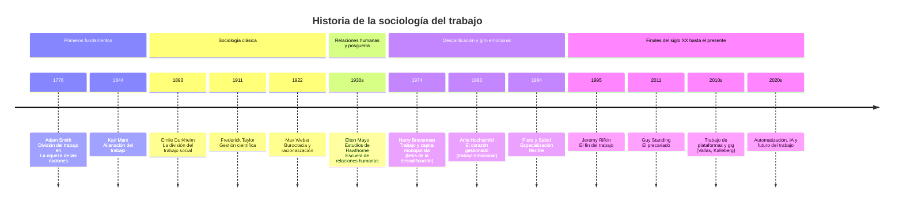

```mermaid
timeline
    title Historia de la sociología del trabajo
    section Primeros fundamentos
      1776 : Adam Smith<br>División del trabajo en<br>La riqueza de las naciones
      1844 : Karl Marx<br>Alienación del trabajo
    section Sociología clásica
      1893 : Émile Durkheim<br>La división del trabajo social
      1911 : Frederick Taylor<br>Gestión científica
      1922 : Max Weber<br>Burocracia y racionalización
    section Relaciones humanas y posguerra
      1930s : Elton Mayo<br>Estudios de Hawthorne<br>Escuela de relaciones humanas
    section Descalificación y giro emocional
      1974 : Harry Braverman<br>Trabajo y capital monopolista<br>(tesis de la descalificación)
      1983 : Arlie Hochschild<br>El corazón gestionado<br>(trabajo emocional)
      1984 : Piore y Sabel<br>Especialización flexible
    section Finales del siglo XX hasta el presente
      1995 : Jeremy Rifkin<br>El fin del trabajo
      2011 : Guy Standing<br>El precariado
      2010s : Trabajo de plataformas y gig<br>(Vallas, Kalleberg)
      2020s : Automatización, IA y<br>futuro del trabajo
```
