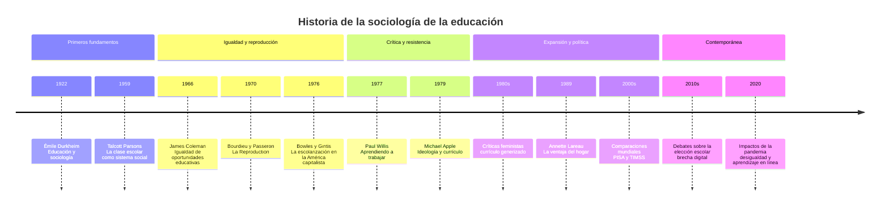

```mermaid
timeline
    title Historia de la sociología de la educación
    section Primeros fundamentos
      1922 : Émile Durkheim<br>Educación y sociología
      1959 : Talcott Parsons<br>La clase escolar como sistema social
    section Igualdad y reproducción
      1966 : James Coleman<br>Igualdad de oportunidades educativas
      1970 : Bourdieu y Passeron<br>La Reproduction
      1976 : Bowles y Gintis<br>La escolarización en la América capitalista
    section Crítica y resistencia
      1977 : Paul Willis<br>Aprendiendo a trabajar
      1979 : Michael Apple<br>Ideología y currículo
    section Expansión y política
      1980s : Críticas feministas<br>currículo generizado
      1989 : Annette Lareau<br>La ventaja del hogar
      2000s : Comparaciones mundiales<br>PISA y TIMSS
    section Contemporánea
      2010s : Debates sobre la elección escolar<br>brecha digital
      2020 : Impactos de la pandemia<br>desigualdad y aprendizaje en línea
```
