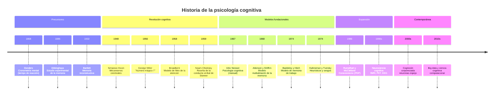

```mermaid
timeline
    title Historia de la psicología cognitiva
    section Precursores
      1868 : Donders<br>Cronometría mental (tiempo de reacción)
      1885 : Ebbinghaus<br>Estudio experimental de la memoria
      1932 : Bartlett<br>Memoria reconstructiva
    section Revolución cognitiva
      1948 : Simposio Hixon<br>Mecanismos cerebrales
      1956 : George Miller<br>"Número mágico 7"
      1958 : Broadbent<br>Modelo de filtro de la atención
      1959 : Noam Chomsky<br>Reseña de la conducta verbal de Skinner
    section Modelos fundacionales
      1967 : Ulric Neisser<br>Psicología cognitiva (manual)
      1968 : Atkinson y Shiffrin<br>Modelo multialmacén de la memoria
      1974 : Baddeley y Hitch<br>Modelo de memoria de trabajo
      1974 : Kahneman y Tversky<br>Heurísticos y sesgos
    section Expansión
      1986 : Rumelhart y McClelland<br>Conexionismo (PDP)
      1990s : Neurociencia cognitiva<br>fMRI, PET, EEG
    section Contemporánea
      2000s : Cognición corporeizada<br>neuronas espejo
      2010s : Big data y ciencia cognitiva<br>computacional
```
