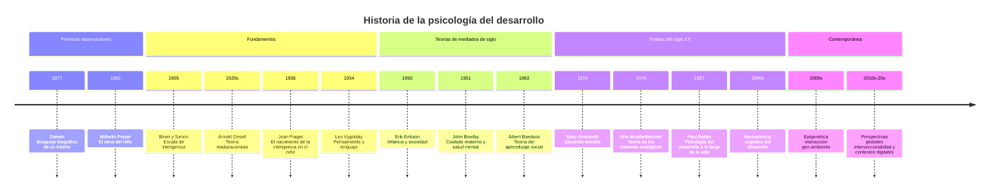

```mermaid
timeline
    title Historia de la psicología del desarrollo
    section Primeras observaciones
      1877 : Darwin<br>Bosquejo biográfico de un infante
      1882 : Wilhelm Preyer<br>El alma del niño
    section Fundamentos
      1905 : Binet y Simon<br>Escala de inteligencia
      1920s : Arnold Gesell<br>Teoría maduracionista
      1936 : Jean Piaget<br>El nacimiento de la inteligencia en el niño
      1934 : Lev Vygotsky<br>Pensamiento y lenguaje
    section Teorías de mediados de siglo
      1950 : Erik Erikson<br>Infancia y sociedad
      1951 : John Bowlby<br>Cuidado materno y salud mental
      1963 : Albert Bandura<br>Teoría del aprendizaje social
    section Finales del siglo XX
      1978 : Mary Ainsworth<br>Situación extraña
      1979 : Urie Bronfenbrenner<br>Teoría de los sistemas ecológicos
      1987 : Paul Baltes<br>Psicología del desarrollo a lo largo de la vida
      1990s : Neurociencia cognitiva del desarrollo
    section Contemporánea
      2000s : Epigenética<br>interacción gen-ambiente
      2010s‑20s : Perspectivas globales<br>interseccionalidad y contextos digitales
```
