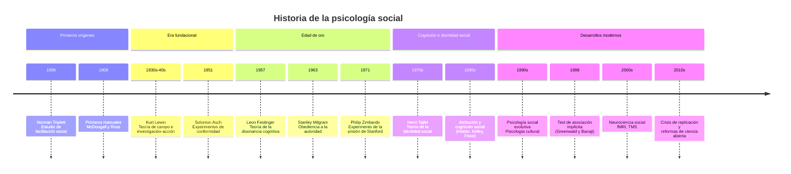

```mermaid
timeline
    title Historia de la psicología social
    section Primeros orígenes
      1898 : Norman Triplett<br>Estudio de facilitación social
      1908 : Primeros manuales<br>McDougall y Ross
    section Era fundacional
      1930s-40s : Kurt Lewin<br>Teoría de campo e investigación-acción
      1951 : Solomon Asch<br>Experimentos de conformidad
    section Edad de oro
      1957 : Leon Festinger<br>Teoría de la disonancia cognitiva
      1963 : Stanley Milgram<br>Obediencia a la autoridad
      1971 : Philip Zimbardo<br>Experimento de la prisión de Stanford
    section Cognición e identidad social
      1970s : Henri Tajfel<br>Teoría de la identidad social
      1980s : Atribución y cognición social<br>(Heider, Kelley, Fiske)
    section Desarrollos modernos
      1990s : Psicología social evolutiva<br>Psicología cultural
      1998 : Test de asociación implícita<br>(Greenwald y Banaji)
      2000s : Neurociencia social<br>fMRI, TMS
      2010s : Crisis de replicación y<br>reformas de ciencia abierta
```
