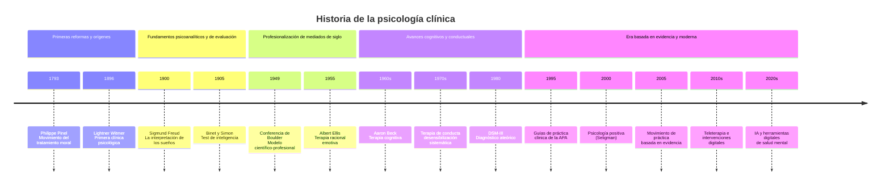

```mermaid
timeline
    title Historia de la psicología clínica
    section Primeras reformas y orígenes
      1793 : Philippe Pinel<br>Movimiento del tratamiento moral
      1896 : Lightner Witmer<br>Primera clínica psicológica
    section Fundamentos psicoanalíticos y de evaluación
      1900 : Sigmund Freud<br>La interpretación de los sueños
      1905 : Binet y Simon<br>Test de inteligencia
    section Profesionalización de mediados de siglo
      1949 : Conferencia de Boulder<br>Modelo científico-profesional
      1955 : Albert Ellis<br>Terapia racional emotiva
    section Avances cognitivos y conductuales
      1960s : Aaron Beck<br>Terapia cognitiva
      1970s : Terapia de conducta<br>desensibilización sistemática
      1980 : DSM‑III<br>Diagnóstico ateórico
    section Era basada en evidencia y moderna
      1995 : Guías de práctica<br>clínica de la APA
      2000 : Psicología positiva<br>(Seligman)
      2005 : Movimiento de práctica<br>basada en evidencia
      2010s : Teleterapia e<br>intervenciones digitales
      2020s : IA y herramientas digitales<br>de salud mental
```
