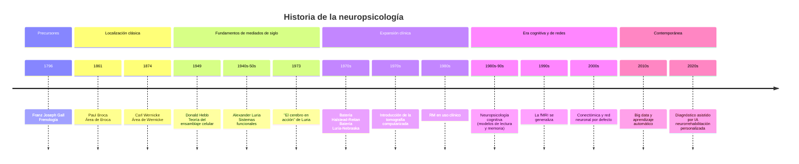

```mermaid
timeline
    title Historia de la neuropsicología
    section Precursores
      1796 : Franz Joseph Gall<br>Frenología
    section Localización clásica
      1861 : Paul Broca<br>Área de Broca
      1874 : Carl Wernicke<br>Área de Wernicke
    section Fundamentos de mediados de siglo
      1949 : Donald Hebb<br>Teoría del ensamblaje celular
      1940s-50s : Alexander Luria<br>Sistemas funcionales
      1973 : "El cerebro en acción" de Luria
    section Expansión clínica
      1970s : Batería Halstead‑Reitan<br>Batería Luria‑Nebraska
      1970s : Introducción de la tomografía computarizada
      1980s : RM en uso clínico
    section Era cognitiva y de redes
      1980s-90s : Neuropsicología cognitiva<br>(modelos de lectura y memoria)
      1990s : La fMRI se generaliza
      2000s : Conectómica y red neuronal por defecto
    section Contemporánea
      2010s : Big data y aprendizaje automático
      2020s : Diagnóstico asistido por IA<br>neurorrehabilitación personalizada
```
